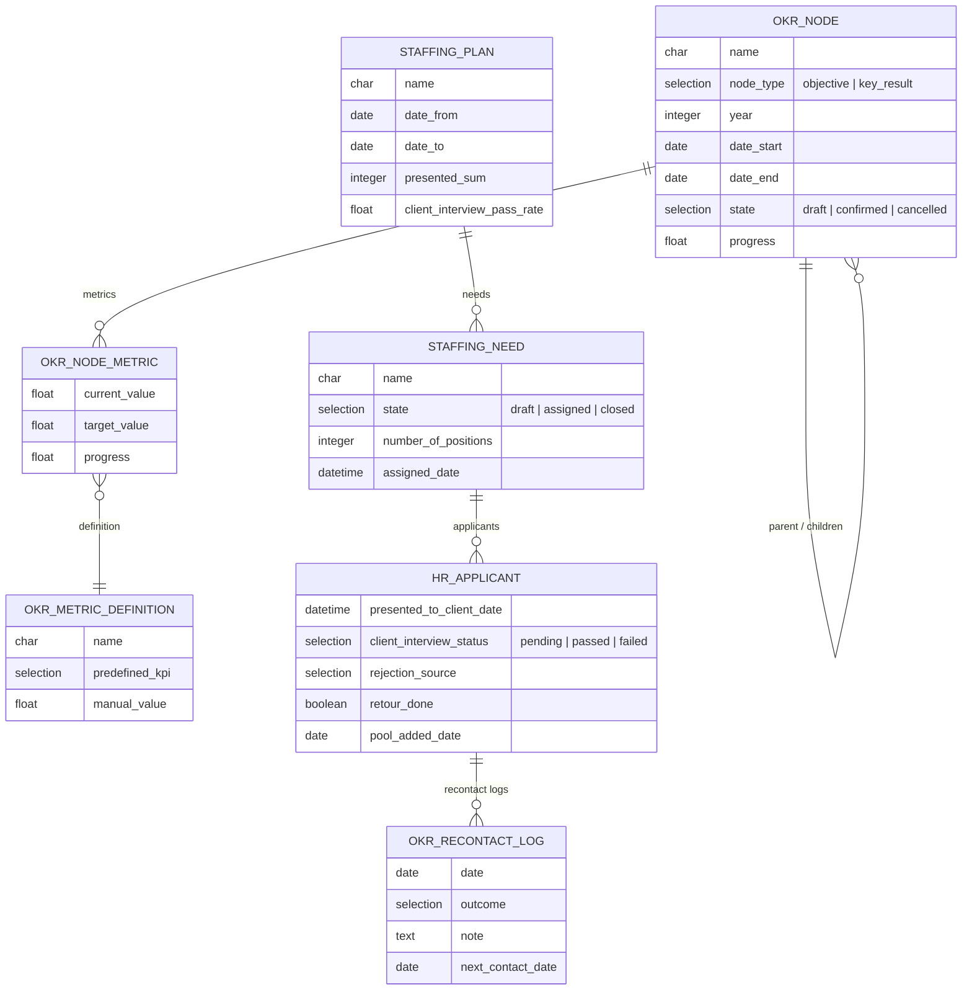

# achmitech_okr — OKR Tracking Module

Odoo 19 module for tracking Objectives and Key Results (OKRs) for recruiters, along with staffing plan management and recruitment KPIs.

---

## Dependencies

```
base, mail, hr, hr_recruitment, achmitech_hr_recruitment
```

`achmitech_hr_recruitment` provides:
- `hr.recruitment.stage.is_client_interview` — flags the EC (entretien client) stage
- `talent_pool_ids`, `is_applicant_in_pool`, `application_status`, `pool_applicant_id` on `hr.applicant`

---

## Model Relationships



> External references not shown: `res.users` (okr.node.user_id, staffing.need.assigned_to), `hr.department` (staffing.plan.department_id), `hr.job` (staffing.need.job_id), `res.company`.

## Security Groups

Defined in `security/security.xml`. Both groups belong to the **OKR** privilege/category.

| Group | XML ID | Description |
|---|---|---|
| OKR / User | `group_okr_user` | Recruiters — read-only access to their own records |
| OKR / Manager | `group_okr_manager` | Managers — full CRUD on all company records |

`group_okr_manager` implies `group_okr_user` (via `implied_ids`).

### Record Rules

All record rules use `noupdate="0"` and are preceded by `<delete>` tags that wipe existing rules on every upgrade. This prevents stale rules from blocking domain updates (a common `noupdate` lock issue in Odoo).

| Model | Group | Filter |
|---|---|---|
| `okr.node` | User | `user_id = me` OR `child_ids.user_id = me` |
| `okr.node` | Manager | company-scoped |
| `okr.node.metric` | User | `node_id.user_id = me` |
| `staffing.need` | User | `assigned_to = me`, company-scoped |
| `staffing.need` | Manager | company-scoped |
| `staffing.plan` | User | has at least one need where `assigned_to = me`, company-scoped |
| `staffing.plan` | Manager | company-scoped |

---

## Models

### `okr.node` — OKR Node

The core model. Represents both **Objectives** and **Key Results** in a single tree structure (self-referential via `parent_id` / `child_ids`).

Key fields:
- `node_type`: `objective` or `key_result`
- `user_id`: assigned recruiter
- `parent_id` / `child_ids`: hierarchy
- `year`, `date_start`, `date_end`: period
- `state`: `draft` → `confirmed` → `cancelled`
- `progress`: float (0.0–1.0), computed from metrics

State transitions (manager only in the UI):
- `action_confirm` — draft → confirmed
- `action_cancel` — confirmed → cancelled
- `action_set_to_draft` — any → draft

### `okr.node.metric` — Metric Line

Links an OKR node to a KPI. Each node can have multiple metric lines.

Key fields:
- `node_id`: parent OKR node
- `metric_definition_id`: points to a `okr.metric.definition` record
- `current_value`: computed by running the KPI function
- `target_value`: manually set target
- `progress`: `current_value / target_value`

### `okr.metric.definition` — Metric Definition

Reusable metric templates. Can use a **predefined KPI** (code-based, auto-computed) or a manual value.

`predefined_kpi` selection values (see `okr_kpi_provider.py`):

| Code | Description |
|---|---|
| `recruitment.need_covered_under_5d_rate` | Besoins couverts durant la période (ratio 0–1) |
| `recruitment.ec_pass_rate` | Taux EC terminé / présentés (ratio 0–1) |
| `recruitment.nok_treated_period_rate` | NOK traités durant la période (ratio 0–1, 1.0 if no NOK) |
| `recruitment.pool_recontacted_rate` | Taux recontact vivier (ratio 0–1) |
| `recruitment.pool_active_count` | Vivier actif — snapshot total (count, target ≈ 100) |
| `recruitment.hires_count` | Consultants démarrés (count, target varies by recruiter level) |

### `okr.kpi.provider` — KPI Registry

KPI functions are registered with the `@kpi("code")` decorator in `models/okr_kpi_provider.py`. Each function receives `(env, node)` and returns a `float`.

To add a new KPI:
1. Add a function in `okr_kpi_provider.py` decorated with `@kpi("your.code")`
2. Add the code to the `predefined_kpi` selection in `okr_metric_definition.py`

### `staffing.plan` — Staffing Plan

Represents a hiring plan for a department over a period.

Key fields:
- `department_id`, `date_from`, `date_to`, `company_id`
- `staffing_need_ids`: One2many to `staffing.need`
- `presented_sum`, `client_interview_passed_sum`, `client_interview_pass_rate`: computed KPIs, scoped to applicants linked to this plan's needs within the plan period

Name is auto-generated from a sequence (`staffing.plan`).

### `staffing.need` — Staffing Need

A single hiring need inside a staffing plan.

Key fields:
- `staffing_plan_id`, `company_id` (related), `job_id`
- `assigned_to`: recruiter responsible
- `assigned_date`: set automatically on `action_assign`
- `number_of_positions`
- `state`: `draft` → `assigned` → `closed`

State transitions (manager only in the UI):
- `action_assign` — sets state to `assigned`, auto-fills `assigned_date`
- `action_close` — sets state to `closed`
- `action_reset_draft` — resets to `draft`

---

## `hr.applicant` Extensions

Fields added to `hr.applicant`:

| Field | Description |
|---|---|
| `staffing_need_id` | Links applicant to a staffing need |
| `presented_to_client_date` | Set by "Présenter au client" button; becomes readonly once set |
| `client_interview_date` | Date of EC |
| `client_interview_status` | `pending` / `passed` / `failed` |
| `is_client_interview_stage` | Related to `stage_id.is_client_interview` (from `achmitech_hr_recruitment`) |
| `rejection_source` | `internal` (recruiter) or `client` |
| `retour_done` / `retour_date` | Whether recruiter feedback to candidate was done |
| `pool_added_date` | Date the applicant was added to the talent pool |
| `recontact_log_ids` | One2many to `okr.recontact.log` |
| `last_recontact_date` | Computed from latest recontact log entry |

### Applicant Header Buttons

| Button | Visible when |
|---|---|
| Recontacter | `is_applicant_in_pool` |
| Présenter au client | `application_status == 'ongoing'` AND `not presented_to_client_date` |
| EC Passé | `is_client_interview_stage` AND `client_interview_status != 'passed'` |
| EC Annulé | `is_client_interview_stage` AND `client_interview_status == 'pending'` |
| Marquer retour fait | `application_status in ('refused', 'hired')` AND `not retour_done` |

**Note on EC Passé:** intentionally visible even when status is `failed` to support rescheduled interviews.

---

## Talent Pool Recontact

When an applicant is in the talent pool, the "Recontacter" button opens a wizard (`okr.recontact.wizard`) to log a recontact attempt. Logs are stored in `okr.recontact.log` and displayed in the "Recontacts Vivier" tab on the applicant form.

---

## Views

| File | Content |
|---|---|
| `okr_node_views.xml` | List, form, hierarchy views for OKR nodes + search with default group-by Objective |
| `okr_node_metric_views.xml` | Metric line views |
| `okr_metric_definition.xml` | Metric definition views |
| `staffing_plan_views.xml` | Staffing plan form/list with inline need management |
| `hr_applicant_views.xml` | Inherits applicant form — adds buttons, fields, recontact tab |
| `okr_menus.xml` | Menu items (main menu + config restricted to managers) |
| `okr_node_progress_inherit.xml` | Progress bar injection |
| `res_company_configuration.xml` | Company-level OKR settings |

---

## Upgrade Command

```bash
/usr/bin/odoo -c /etc/odoo/odoo.conf -d odoo19 -u achmitech_okr \
  --db_host=db --db_port=5432 --db_user=odoo --db_password=odoo \
  --stop-after-init
```

---

## Known Patterns & Gotchas

- **`noupdate` lock**: Record rules in `security/security.xml` are wrapped in `<data noupdate="0">` but also preceded by `<delete>` tags in a plain `<data>` block. This ensures stale rules are always wiped and recreated on upgrade, bypassing the `ir.model.data` noupdate lock.
- **`ir.model.access.csv` IDs**: Never rename existing access IDs — Odoo only overwrites records whose XML ID still exists. Changing an ID orphans the old record in DB.
- **Hierarchy view**: The hierarchy action must include `form` in `view_mode` (`hierarchy,form`) for cards to be clickable and open the form.
- **`pool_active_count` KPI**: Snapshot of total active pool size — no date filter. Counts all applicants currently in the talent pool assigned to the recruiter.
- **`hires_count` KPI**: No seniority filter. Target is set per metric record depending on recruiter level (e.g. En stage → 2/month, Confirmé+ → 4/month).
